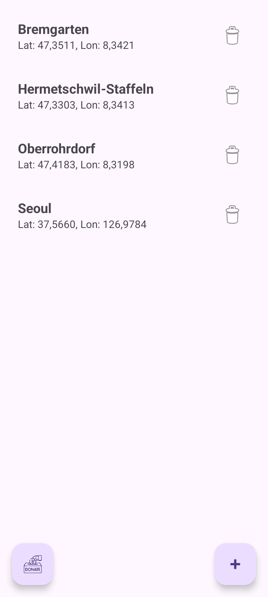
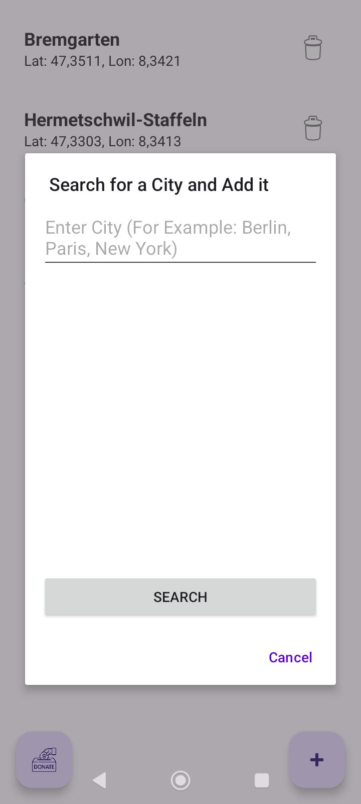
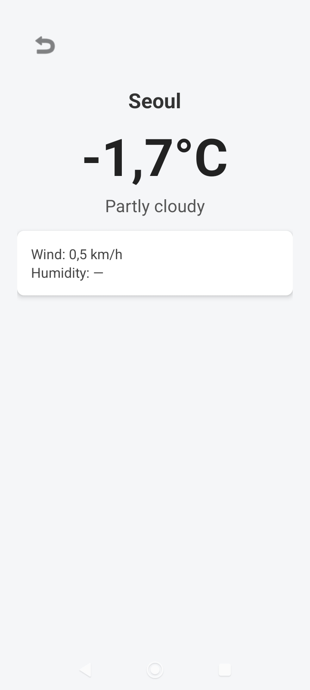
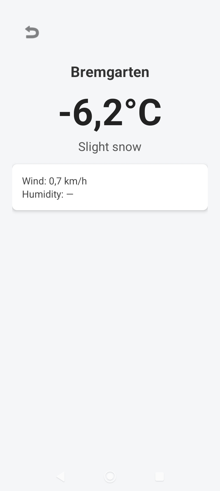

<h1>🌤️ GeoWeather</h1>

<i>A modern weather app for Android, inspired by MeteoSwiss</i>

<h1>📸 Pictures of GeoWeather in Action</h1>

<h1>Repository and Build Informations</h1>

GeoWeather is a modern Android weather application that allows you to monitor weather conditions for multiple cities. The app was inspired by the Swiss weather app MeteoSwiss and offers an intuitive interface with detailed weather information.

## ✨ Key Features

- 🏙️ **Multiple Cities**: Add and manage unlimited cities with ease
- 🌡️ **Unit Switching**: Switch between Celsius/Fahrenheit and km/h/mph
- 📅 **7-Day Weather Forecast**: Detailed weather predictions for the entire week
- ⏰ **Hourly Forecast**: Precise weather data on an hourly basis
- 🎨 **Material YOU**: Dynamic colors based on your wallpaper (Android 12+)
- 🎨 **Weather Icons**: Visual representation of weather conditions
- 🔔 **Notifications**: Receive weather alerts and updates
- 📝 **Integrated Change Log**: Track version updates directly in the app

## 🛠️ Technology Stack

- **Jetpack Compose**: Modern UI framework for declarative interfaces
- **Kotlin**: Modern programming language for Android development
- **Kotlin DSL**: For build configuration and scripts
- **Room**: Local database for persistent data storage
- **Retrofit & OkHttp**: Network communication for weather APIs
- **Coil**: Image loading library for Compose
- **WorkManager**: Background processing for regular updates

## 📥 Download & Installation

### Get the Latest Version

You can download the latest version of GeoWeather from the following platforms:

- **GitHub Releases**: [Direct Download](https://github.com/FreetimeMaker/GeoWeather/releases/latest)
- **F-Droid**: [io.github.freetimemaker.geoweather](https://f-droid.org/packages/io.github.freetimemaker.geoweather)
- **OpenAPK**: [GeoWeather on OpenAPK](https://www.openapk.net/geoweather/io.github.freetimemaker.geoweather/)
- **Obtainium**: [Automatic Updates](https://apps.obtainium.imranr.dev/redirect?r=obtainium://app/%7B%22id%22%3A%22io.github.freetimemaker.geoweather%22%2C%22url%22%3A%22https%3A%2F%2Fgithub.com%2FFreetimeMaker%2FGeoWeather%22%2C%22author%22%3A%22Freetime%20Maker%22%2C%22name%22%3A%22GeoWeather%22%2C%22additionalSettings%22%3A%22%7B%5C%22includePrereleases%5C%22%3Afalse%7D%22%7D)

## 🚀 Upcoming Features

Planned:

- 📸 **App Demonstration**: Screenshots and video tutorials on YouTube and other platforms
- 📊 **Weather History**: Historical weather data and trends

## 📄 License

This project is licensed under the [Apache-2.0 License](LICENSE).

## 🤝 Contributing

Contributions are welcome! Feel free to open issues or submit pull requests.

## 🌟 Star History

<a href="https://www.star-history.com/#FreetimeMaker/GeoWeather&type=date&legend=top-left">
 <picture>
   <source media="(prefers-color-scheme: dark)" srcset="https://api.star-history.com/svg?repos=FreetimeMaker/GeoWeather&type=date&theme=dark&legend=top-left" />
   <source media="(prefers-color-scheme: light)" srcset="https://api.star-history.com/svg?repos=FreetimeMaker/GeoWeather&type=date&legend=top-left" />
   
 </picture>
</a>

---

## 🤝 Donations

If you like GeoWeather, I'd appreciate a small donation — thank you! Below are some common cryptocurrency options.

Alternatively, you can also display the addresses directly:

- Bitcoin (BTC): `1DsCAVrzvGokrzXpe6YR33QuTo5EppiKRE` — or open in block explorer by clicking the badge above
- Litecoin (LTC): `LU2ERRXKTeKnzpuieQcpsBteViEY7ff5Wg` — or open in block explorer by clicking the badge above

<i>Developed with ❤️ by FreetimeMaker</i>

